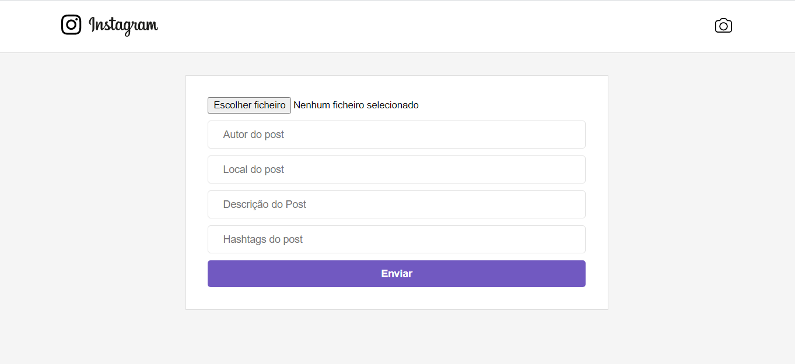

# Instagram home page clone 
>Amazing instagram interface clone. 

In this project i created instagram first page, basically i copied the the publish card and added some features
like liking a post oftentimes and make sharing.


## Instalation 

Go to cmd and run the code below 

```sh
yarn install
```

After all dependecies installed

**To run**

```sh
yarn start 
```

## _Configuration_ (optional)

I disabled some features in my end-point from api https://github.com/cientista1/instabackend
You shout make tour api.

Go to services folder, in ```javascript api.index ``` change **url** and **url_image** variable value. 

If you want edit this project and upload to git hub page, you must do it

1. Go to package.json
2. Edit homepage 
3. Git init 
4. ... Other git commands to push in you repository 

**To build**

```sh
yarn build 
```

**To upload on your github page**

```sh
yarn deploy 
```

## This project has some funcionalities

* Sharing a status 



* liking a status 


* Responsivities 


## Meta

Author -  [Lutero Elavoco](https://www.linkedin.com/in/l%C3%BAtero-elavoco-5951b619b/) - luteroelavoco90@gmail.com

https://cientista1.github.io/instafrontend/#/

## Contributing 

1. Fork it (https://github.com/cientista1/instafrontend)
2. Create your feature branch (`git checkout -b feature/fooBar`)
3. Commit your changes (`git commit -am 'Add some fooBar'`)
4. Push to the branch (`git push origin feature/fooBar`)
5. Create a new Pull Request

